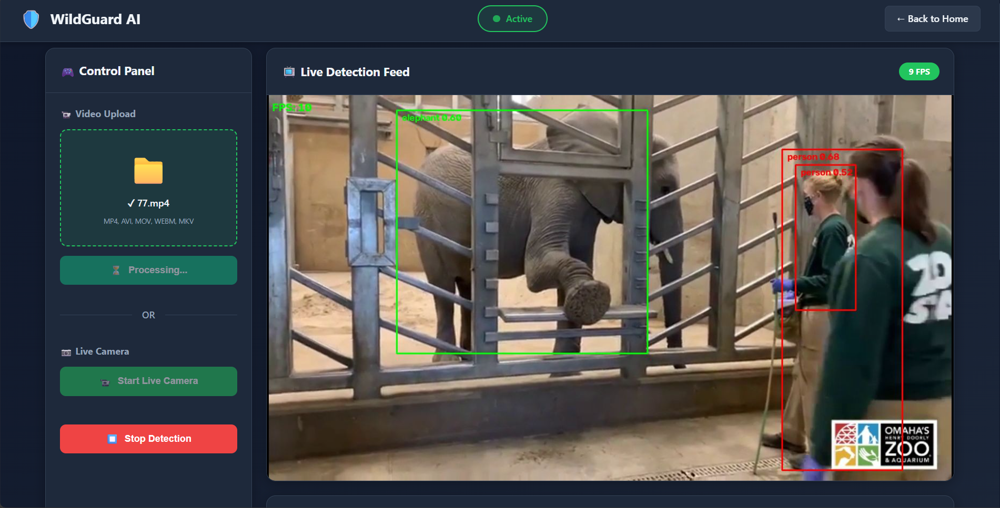
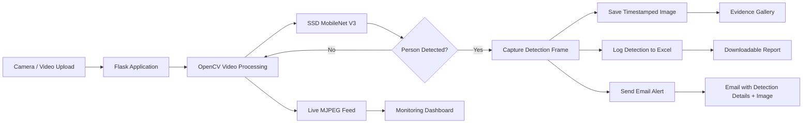

# 🛡️ WildGuard AI
### Real-Time Wildlife Surveillance & Potential Poaching Detection System

<p align="center">
  <strong>Computer Vision • Real-Time Detection • Automated Alerts • Evidence Logging</strong>
</p>

<p align="center">
  
  
  
  
</p>

<p align="center">
  
  
  
  
  
</p>

---

## 🌲 Overview

**WildGuard AI** is a web-based wildlife surveillance system designed to detect **potentially suspicious human activity** in monitored areas using real-time computer vision.

The system combines **OpenCV's DNN inference pipeline**, a pre-trained **SSD MobileNet V3 object-detection model**, a **Flask web application**, automated **email notifications**, timestamped image evidence, and **Excel-based detection logging** into one workflow.

Instead of simply displaying a detection, WildGuard AI connects the complete pipeline:

> **Video / Camera → Object Detection → Human Detection → Evidence Capture → Email Alert → Data Logging → Dashboard Review**

The project was built to demonstrate how computer vision can be integrated with a practical monitoring and response workflow.

---

## ✨ Key Features

| Capability | Description |
|---|---|
| 🎥 **Live Camera Detection** | Process frames from a connected camera in real time. |
| 📁 **Video Upload Detection** | Upload MP4, AVI, MOV, WEBM or MKV footage for analysis. |
| 🧠 **Object Detection** | Uses SSD MobileNet V3 through OpenCV's DNN module. |
| 👤 **Human Detection** | Treats detected humans as potential suspicious activity and triggers the alert workflow. |
| 🐾 **Animal Detection** | Identifies supported animal classes from the COCO object classes. |
| 🚨 **Automated Alerts** | Sends an email alert when a human is detected. |
| 📸 **Evidence Capture** | Saves the detection frame with a timestamp. |
| 📊 **Detection Logging** | Stores timestamp, person status, animals and image filename in Excel. |
| 🖼️ **Evidence Gallery** | Browse captured detection images from the dashboard. |
| 📈 **Live Statistics** | Displays detections, alerts sent, last detection and FPS. |
| 📥 **Report Export** | Download the detection log as an Excel file. |
| ⚡ **Alert Cooldown** | Uses a 10-second cooldown to reduce repeated alerts for continuous detections. |
| 🔄 **Asynchronous Processing** | Image saving, Excel logging and email delivery are handled in background threads. |
| 🌐 **Web Dashboard** | Provides a browser-based control and monitoring interface. |

---

## 🖥️ System Preview

### Detection Evidence

<p align="center">
  
</p>

> Detection frames are automatically saved with timestamps and can be reviewed from the dashboard gallery.

---

## 🧩 How the System Works



### Detection pipeline

**1. Input**

The system accepts either:

- Live camera input
- Uploaded surveillance footage

**2. Frame processing**

Each frame is read with OpenCV and resized when necessary before inference.

**3. Object detection**

SSD MobileNet V3 processes the frame through OpenCV's DNN API using a 320 × 320 input.

**4. Threat trigger**

When a `person` class is detected, the system considers the event potential suspicious activity and starts the alert workflow.

**5. Evidence generation**

The current frame is saved as a timestamped JPEG.

**6. Parallel response**

Three operations are triggered:

- Detection statistics are updated
- Detection information is written to Excel
- An email alert containing the detection details and captured image is sent

**7. Dashboard monitoring**

The browser dashboard receives the processed video stream and polls the backend for live statistics.

---

## 🚨 Alert Workflow

A detection does not stop at a bounding box.

```text
Person detected
      ↓
10-second alert cooldown checked
      ↓
Detection frame captured
      ↓
Timestamped evidence saved
      ↓
Detection logged to Excel
      ↓
Email alert generated
      ↓
Captured image attached inline
      ↓
Dashboard statistics updated
```

The email includes:

- Monitoring area
- Detection timestamp
- Person detection status
- Detected animals
- Captured detection image

---

## 🧠 Computer Vision

WildGuard AI uses:

**SSD MobileNet V3 Large + COCO object classes**

The model is loaded using:

```python
cv2.dnn_DetectionModel(
    "frozen_inference_graph.pb",
    "ssd_mobilenet_v3_large_coco_2020_01_14.pbtxt"
)
```

The detection pipeline is configured with:

- Input size: `320 × 320`
- Confidence threshold: `0.5`
- RGB channel swapping
- OpenCV DNN inference

The application uses the COCO class list provided in `coco.names`.

### Supported wildlife classes in the application

The current detection logic checks for:

`bird` · `cat` · `dog` · `cow` · `horse` · `sheep` · `elephant` · `bear` · `zebra` · `giraffe`

The primary alert trigger is the detection of the **`person`** class.

---

## 📊 Dashboard

The dashboard provides a centralized monitoring interface with:

### Control Panel
- Upload surveillance footage
- Start live camera
- Stop detection

### Live Feed
- Real-time processed video
- Bounding boxes
- Object labels
- Confidence scores
- FPS indicator

### Statistics
- Total detections
- Alerts sent
- Last detection time
- Current FPS

### Evidence Management
- Detection image gallery
- Full-size image preview
- Timestamp information
- Image deletion

### Reporting
- Download detection history as `.xlsx`

---

## 🧰 Technology Stack

### Backend


### Computer Vision


**Model:** SSD MobileNet V3 Large  
**Model classes:** COCO object classes  
**Inference:** OpenCV DNN

### Data & Reporting


- Pandas for structured detection data
- OpenPyXL for Excel file generation/handling

### Frontend


### Communication

**SMTP / Gmail** for automated email notifications.

---

## 📁 Project Structure

```text
WildGuard-AI/
│
├── app.py
├── final1.py
├── requirements.txt
│
├── coco.names
├── frozen_inference_graph.pb
├── ssd_mobilenet_v3_large_coco_2020_01_14.pbtxt
│
├── templates/
│   ├── landing.html
│   └── dashboard.html
│
├── static/
│   ├── landing.css
│   ├── landing.js
│   └── dashboard.css
│
├── uploads/
│   └── uploaded surveillance videos
│
├── detected_images/
│   └── timestamped detection evidence
│
├── detection_log.xlsx
├── poaching_records.xlsx
└── output.avi
```

---

## ⚙️ Installation

### 1. Clone the repository

```bash
git clone <YOUR_REPOSITORY_URL>
cd "Real-Time Surveillance and Poaching Detection System with Email Notifications"
```

### 2. Create a virtual environment

```bash
python -m venv venv
```

Activate it:

**Windows**

```bash
venv\Scripts\activate
```

**macOS / Linux**

```bash
source venv/bin/activate
```

### 3. Install dependencies

```bash
pip install -r requirements.txt
```

### 4. Configure email credentials

Before running the application, configure the sender and receiver email settings in `app.py`.

For Gmail, use a **Google App Password**, not your normal account password.

> ⚠️ For production deployment, credentials should be moved to environment variables or a secret manager instead of being stored directly in source code.

### 5. Start the application

```bash
python app.py
```

The Flask server runs on:

```text
http://localhost:5000
```

Open the dashboard at:

```text
http://localhost:5000/dashboard
```

---

## ▶️ Usage

### Option A — Live Camera

1. Open the dashboard.
2. Select **Start Live Camera**.
3. The system begins processing camera frames.
4. Detected objects are displayed with bounding boxes.
5. If a person is detected:
   - Evidence is captured.
   - Detection is logged.
   - Email alert is triggered.
6. Review the event from the gallery.

### Option B — Video Upload

1. Open the dashboard.
2. Select a supported video file.
3. Click **Start Detection**.
4. Monitor the processed feed.
5. Review generated alerts and evidence.

---

## 🔐 Security Considerations

This project is a **demonstration / prototype system** and should not be treated as a production wildlife-surveillance platform without additional security and reliability work.

Recommended production improvements include:

- Environment-based secrets
- Authentication and authorization
- HTTPS
- Secure upload validation
- Rate limiting
- Structured database storage
- Audit logging
- Background job infrastructure
- Model validation on domain-specific wildlife footage
- Secure deployment configuration
- Privacy controls for captured images

---

## ⚠️ Detection Scope & Limitations

WildGuard AI should be understood as a **potential suspicious-activity detection demonstrator**, not a complete poaching classifier.

The current implementation triggers its alert workflow when it detects a **person**. Detecting a person does not inherently prove poaching.

The system therefore demonstrates the technical pipeline:

> **Person Detection → Evidence Capture → Alert → Review**

rather than claiming that the model can independently determine whether an actual poaching event has occurred.

The underlying SSD MobileNet V3 model is a general object detector using COCO classes, so domain-specific wildlife performance may vary depending on:

- Camera placement
- Lighting
- Occlusion
- Distance from the subject
- Image quality
- Environmental conditions
- Object size
- Species representation in the source model

---

## 🧪 Example Detection Log

The project stores detection events in `detection_log.xlsx` using fields such as:

| Timestamp | Person Detected | Animals Detected | Image Filename |
|---|---|---|---|
| `2025-11-29 18:28:34` | Yes | — | `detection_2025-11-29_18-28-34.jpg` |
| `2025-11-29 18:28:44` | Yes | — | `detection_2025-11-29_18-28-44.jpg` |

This creates a simple historical record that can be downloaded from the dashboard.

---

## 🚀 Future Improvements

Potential next steps for evolving WildGuard AI into a more production-oriented system:

- [ ] Train/fine-tune a wildlife-specific detection model
- [ ] Distinguish rangers, visitors and potential intruders
- [ ] Add multi-camera support
- [ ] Add location-aware alerts
- [ ] Add SMS / WhatsApp notifications
- [ ] Replace Excel with PostgreSQL or another database
- [ ] Add authentication and role-based access
- [ ] Add alert severity levels
- [ ] Add detection confidence analytics
- [ ] Add historical charts and trend analysis
- [ ] Add cloud deployment
- [ ] Add containerized deployment with Docker
- [ ] Add automated testing and CI/CD

---

## 💡 Engineering Highlights

What makes this project more than a basic object-detection demo is the **end-to-end application workflow** around the model.

### 1. Real-time processing

Frames are continuously processed and streamed back to the browser using an MJPEG response.

### 2. Non-blocking alert workflow

Detection evidence, Excel logging and email delivery are handled asynchronously so the main detection loop can continue processing frames.

### 3. Alert throttling

A cooldown mechanism prevents the same continuous human presence from generating an email every frame.

### 4. Evidence persistence

Every triggered event produces a timestamped image that can later be reviewed from the dashboard.

### 5. Operational dashboard

The frontend does not simply display a model output. It provides controls, statistics, alerts, reporting and evidence management around the detection pipeline.

---

## 🌟 Why This Project Matters

Wildlife monitoring often involves large areas, difficult terrain and situations where continuous human observation is impractical.

WildGuard AI explores how computer vision can act as an **automated first layer of surveillance**, helping surface potentially suspicious activity so that a human operator or ranger can investigate it.

The core idea is simple:

> **Detect early. Capture evidence. Alert quickly. Let humans make the final decision.**

---

## 👩‍💻 Author

**Samruddhi Shinde**

Information Technology Student @ VIT Pune  
Full Stack Developer • AI/ML Enthusiast

<p>
  <a href="https://samruddhi-portfolio-five.vercel.app/">
    
  </a>
  <a href="https://www.linkedin.com/in/samruddhi-shinde-37a3862a8/">
    
  </a>
</p>

---

<p align="center">
  <strong>🛡️ WildGuard AI</strong><br>
  <sub>Computer Vision for Wildlife Protection</sub>
</p>
